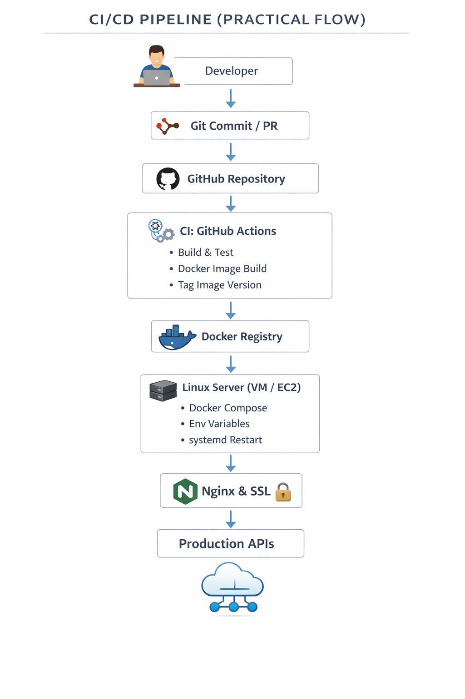

# Ashwani Pandey (@ashwanipydev)

📍 India  
💼 **DevOps Engineer (Backend → DevOps Transition)**  
🔧 Linux | Docker | CI/CD | Spring Boot | Cloud Fundamentals  

---

## PROFESSIONAL SUMMARY

DevOps-oriented engineer with strong **Java Spring Boot backend experience** and hands-on practice in **Linux server administration, containerization, and service deployments**.  
Experienced in owning the **full lifecycle** of applications: build, deploy, configure, secure, monitor, and troubleshoot in production-like environments.

Actively preparing for **DevOps / Platform Engineer roles** with a focus on real-world infrastructure and automation.

---

## CI/CD PIPELINE (PRACTICAL FLOW)

  

---

## CORE DEVOPS SKILLS

### Linux & System Administration
- Ubuntu / CentOS
- systemd services
- Process & memory management
- Log analysis (`journalctl`, app logs)
- File system & permissions

### Containers & Deployment
- Docker
- Docker Compose
- Containerizing Spring Boot microservices
- Multi-service deployments on a single VM

### CI/CD
- Git & GitHub (PR workflow, branching)
- GitHub Actions (learning & hands-on)
- Build → Test → Docker → Deploy flow
- Environment-specific configurations

### Networking & Web
- Nginx reverse proxy
- SSL / TLS certificates
- Port & firewall configuration
- API routing

### Cloud (Foundational)
- AWS EC2
- Security Groups
- IAM basics
- Cost-awareness & VM hosting

---

## BACKEND ENGINEERING (SUPPORTING DEVOPS)

- Java 17
- Spring Boot
- Spring Security (JWT)
- REST API design
- Microservices architecture

### Databases & Caching
- PostgreSQL
- MongoDB
- Redis

---

## PROJECT EXPERIENCE

### HR & Attendance Management System
- Microservices-based backend
- Secure JWT authentication service
- PostgreSQL + Redis
- Dockerized deployment
- Linux VM hosting with Nginx

### Auth Service (JWT)
- Token-based authentication
- Spring Security
- Docker container
- systemd-managed service

### Infrastructure Practice
- Running multiple Spring Boot services on one server
- Reverse proxy with SSL
- Log-based troubleshooting
- Environment isolation (UAT / Prod style)

---

## CURRENT FOCUS (2026)

- Advanced CI/CD pipelines
- AWS services for DevOps
- Observability & monitoring basics
- Infrastructure reliability & automation
- Interview-ready DevOps fundamentals

---

## TOOLS & TECHNOLOGIES

| Category | Tools |
|--------|------|
| OS | Linux |
| Containers | Docker, Docker Compose |
| CI/CD | GitHub Actions |
| Web | Nginx |
| Backend | Java, Spring Boot |
| DB | PostgreSQL, MongoDB |
| Cache | Redis |
| SCM | Git, GitHub |

---

## CONTACT

- GitHub: https://github.com/ashwanipydev
- Email: *pydev.ashwani@gmail.com*

---

🚀 *Build. Deploy. Operate. Improve.*
